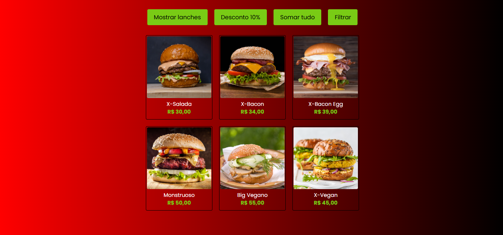

# Projeto JS - Burger

Um projeto simples em **JavaScript**, **HTML** e **CSS** para praticar manipulação de arrays e DOM, exibindo um cardápio de lanches com diversas funcionalidades dinâmicas.

## Funcionalidades

- **Mostrar todos os lanches:** exibe todos os itens do cardápio na tela.  
- **Aplicar desconto:** reduz o preço de todos os lanches em **10%** utilizando o método `map()`.  
- **Somar valores:** calcula o valor total de todos os lanches usando o método `reduce()`.  
- **Filtrar lanches veganos:** exibe apenas os lanches veganos com o método `filter()`.

## Conceitos praticados

- Manipulação de **arrays** (`map`, `reduce`, `filter`, `forEach`)
- Manipulação do **DOM**
- Uso de **template strings**
- Formatação de valores com `toFixed()` e `replace()`
- Estrutura de componentes simples com **HTML, CSS e JS puros**

## 💻 Tecnologias utilizadas

- **HTML**
- **CSS**
- **JavaScript**

## Pré-visualização

## 📂 Estrutura de pastas
projeto-burger/
│
├── index.html
├── style.css
├── script.js
├── products.js
├── readme.md
└── assets/
├── preview.png
├── xsalada.jpeg
├── xbacon.png
├── bacon-egg.png
├── monstruoso.png
├── xvegan.png
└── monstruoso-vegan.png

